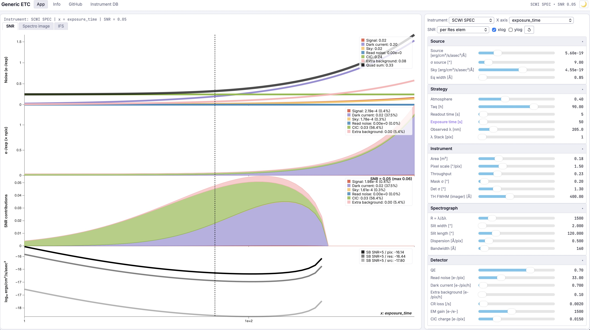
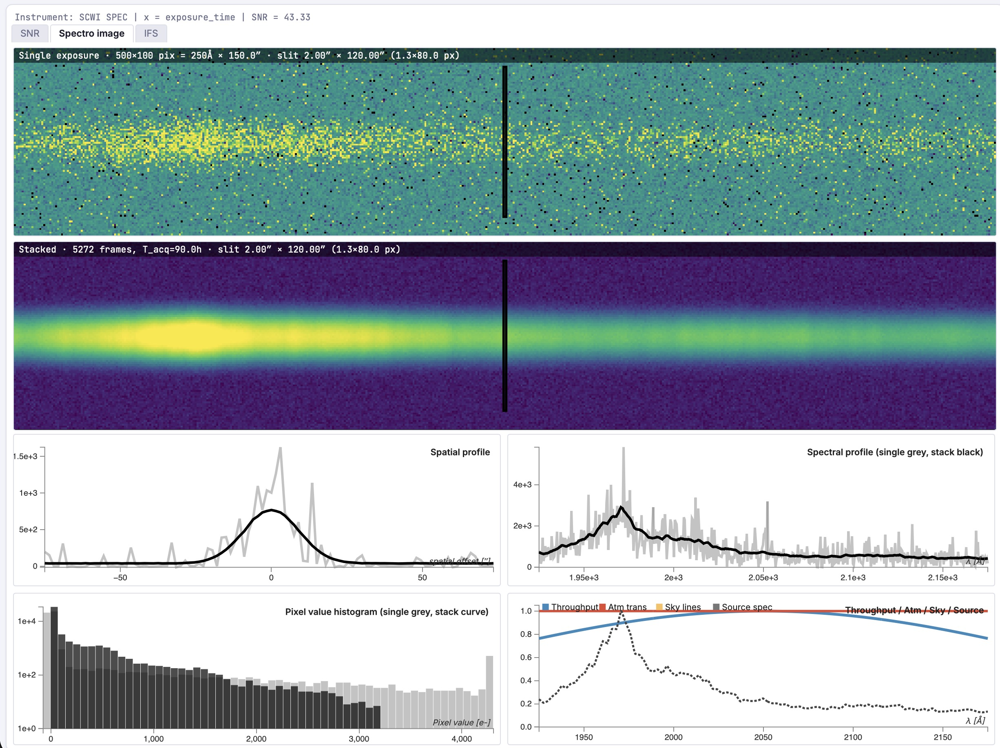
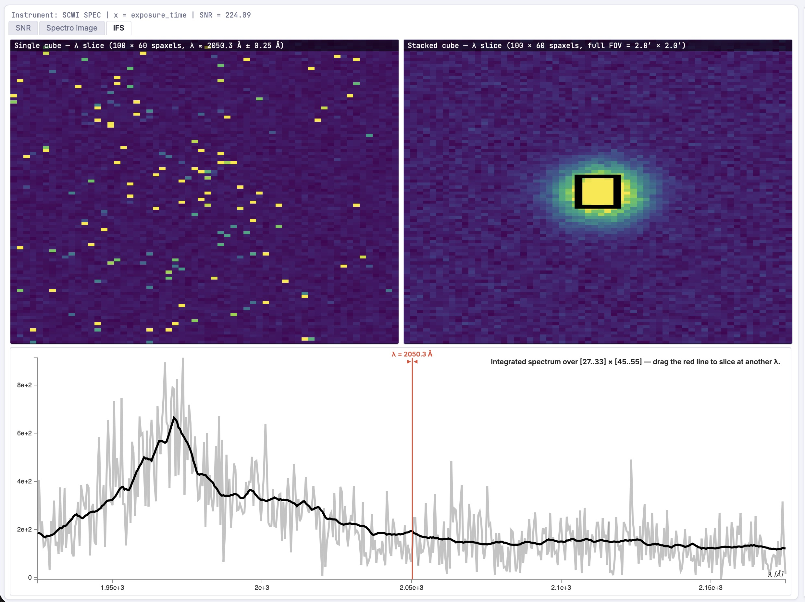

# Generic ETC — User Guide & Methodology

## 1 · About this tool {#about}

**etc-app** is a browser-only port of the [Generic ETC](https://github.com/vpicouet/generic-etc) Jupyter notebook, written in JavaScript and D3 so it runs entirely client-side and can be served from GitHub Pages. It sits at the intersection of an exposure-time calculator and a spectrograph simulator: not only does it predict the signal-to-noise ratio of a target observation, it lets you explore how the SNR responds to *any* instrument or observation parameter, and renders simulated detector images and IFS cubes that you can manipulate live.

The instrument database is shared with the Python ETC and lives in a [Google Sheet](https://docs.google.com/spreadsheets/d/1Ox0uxEm2TfgzYA6ivkTpU4xrmN5vO5kmnUPdCSt73uU/edit). The application loads it through the public `gviz/tq` CSV endpoint, so adding a new spectrograph configuration in the sheet makes it immediately available in the app without any code change.

Accuracy is sufficient for trade studies, design exploration, instrument comparison and teaching. For final observation preparation an instrument-specific ETC should be used when available.

*Figure 1 — The SNR view. Left: four stacked panels (noise budget, contributions, SNR contributions and SNR=5 surface-brightness limit) as a function of any selected parameter. Right: collapsible parameter accordions (Source, Strategy, Instrument, Spectrograph, Detector). The vertical dashed cursor on each panel is draggable and updates the current parameter value.*

## 2 · Quick start {#quickstart}

1. Pick an instrument in the **Instrument** dropdown of the top bar. The accordions below are populated automatically.
2. Pick the parameter you want to vary in **X axis**. Equivalently, click on a parameter *label* in an accordion (the active x-axis is highlighted in orange).
3. Pick an integration mode in **SNR** (per pixel, per resolution element, or per source — see [§5.2](#snr-modes)).
4. The four SNR panels render in real time. **Drag the vertical dashed line** horizontally to set the current value of the swept parameter — the slider on the right syncs.
5. Switch to **Spectro image** to see a simulated detector frame (single exposure and stack of `N_images_true` frames). Right-click + drag (or ctrl-click + drag on a Mac trackpad) on either image to bias/contrast the colormap, DS9-style. Double-click resets.
6. For instruments declared as integral-field (`dimensions=3` in the sheet), an **IFS** view appears with two cube λ-slices and a draggable extraction box.

## 3 · User interface {#ui}

### 3.1 Layout overview {#ui-layout}

The viewport is split into two columns. The left column hosts the plot area with three switchable views (SNR / Spectro image / IFS). The right column hosts the controls: a top bar with the instrument selector and global toggles, the parameter accordions, and at the bottom the *Parameter dependencies* and *Image options* accordions.

### 3.2 SNR view {#ui-snr}

Three stacked sub-panels share the same x-axis (Figure 1):

1. **Noise budget** — noise contributions (signal, dark, sky, read noise, CIC, extra background) and their quadratic sum.
2. **Contribution stack** — average electron counts per pixel (or per resolution element / per source, depending on the SNR mode) stacked on top of each other.
3. **SNR contribution stack** — the same components rescaled so the stack sums to the total SNR. Useful to identify which noise source drives the SNR at any point of the parameter sweep. The Surface-brightness limit (SNR = 5) is added in the legend.

Each panel has its own legend overlaid in the top-right corner. Hovering over a panel shows a tooltip with the value of every series at the cursor's x position. The vertical dashed cursor at the current parameter value is draggable; releasing it updates the corresponding slider and re-renders.

### 3.3 Spectro image view {#ui-image}

*Figure 2 — Spectro image view. Top: simulated detector frames (single exposure on top, stacked on the bottom), with the slit footprint outlined in black. Bottom row: spatial profile, spectral profile, optical curves (throughput, atmospheric transmission, sky lines, source spectrum) and the pixel-value histogram.*

The two top images are the same simulated detector frame rendered with a Poisson realisation: the upper one is a single exposure (high noise), the lower one is the stack of `N_images_true` frames (Poisson summed analytically, mean RN divided by √N). The dashed black rectangle marks the geometric slit projection (`Slitwidth/pixel_scale` × `Slitlength/pixel_scale` in detector pixels). The four panels below are described in [§6](#image).

### 3.4 IFS view {#ui-ifs}

*Figure 3 — IFS view. Top: two cube λ-slices (single and stacked exposures, H × n3 spaxels) at the wavelength marked by the red cursor on the spectrum below. Drag the cursor to re-slice live. The black rectangle on the stacked image is the extraction region — drag it (move, or grab the corners to resize) to update the integrated spectrum.*

The IFS view appears only when the current instrument has `dimensions=3` (or `IFS=1`) in the sheet. The number of slicers/fibres `n3` is computed from the field of view and the slit width — see [§7](#ifs).

### 3.5 Image options & colormap {#ui-imgopts}

The **Image options** accordion controls the simulator only (no effect on the SNR plot):

- **Display mode** — `Sim image` (noisy realisation), `Source` (noiseless target), `Convolved source`, `SNR` (per-pixel SNR map).
- **Spectrum** — the source spectral shape: a Gaussian emission line (*Baseline emission line*) or one of ~99 baked SEDs (HST/FOS QSOs, COSMOS galaxies, Salvato QSO templates).
- **Atm curve** — `pwv_kpno` (ground) or `transmission_ground`. If the curve is identically zero across the detector window (e.g. `pwv_kpno` in the deep UV) the app falls back to a flat atm so the source remains visible.
- **Sky-line catalogue** — `spectra_0.2A` (Paranal-like) or `UV_atm_lines` for UV instruments.
- **Throughput(λ) shaping**, **Atmospheric absorption**, **Sky emission lines** — three independent toggles to apply the curves above.
- **Colormap picker** — six gradient strips (viridis / inferno / plasma / cividis / gray / hot). Click one to apply to all `imshow` canvases. The choice is persisted in `localStorage`.

### 3.6 Parameter dependencies {#ui-deps}

Mirror of the `SelectMultiple` dependency widget of `Observation.py`. Tick a box and the dependent parameter is computed from the others on every update (its slider is hidden):

- `dispersion = 10 · λ / R / 2` — Nyquist sampling of the spectral resolution element.
- `pixel_scale = 2.35 · PSF_RMS_det / 2` — Nyquist sampling of the spatial PSF.

Dependencies are vector-aware: if the dependent parameter is itself swept on the x-axis, the formula is applied at each x.

## 4 · Parameters reference {#params}

Every parameter usable as an x-axis can be inspected in two ways: its full name + units appears in the slider tooltip (hover), and clicking the label highlights it as the active x-axis. The groups below mirror the accordion structure in the app.

| Group | Parameter | Symbol | Unit | Note |
|---|---|---|---|---|
| **Source** | Source flux | $F$ | erg/cm²/s/asec²/Å | Diffuse surface brightness |
| | Sky background | $F_\text{sky}$ | erg/cm²/s/asec²/Å | Zodiacal + galactic / sky continuum |
| | σ source | $\sigma_x$ | arcsec | Spatial RMS (Gaussian) |
| | Equivalent width | $\sigma_\lambda$ | Å | Spectral RMS for the line model |
| **Strategy** | Atmosphere | $A_\%$ | 0–1 | Scalar transmission |
| | Acquisition time | $T_\text{tot}$ | h | Total wall-clock time |
| | Exposure time | $t_\text{exp}$ | s | Single frame |
| | Readout time | $t_\text{RO}$ | s | Between frames |
| | Observed λ | $\lambda$ | nm | Central wavelength |
| | λ Stack | $N_\text{stack}^\lambda$ | pix | Spectral binning (imager only) |
| **Instrument** | Collecting area | $A_\text{tel}$ | m² | After obstruction |
| | Pixel scale | $p$ | ″/pix | Plate scale |
| | Throughput | $T_\%$ | 0–1 | Optics, excluding QE and atm |
| | σ mask, σ det | $\sigma_\text{mask}, \sigma_\text{det}$ | arcsec | PSF RMS at slit / at detector |
| | Throughput FWHM | $\Delta\lambda_T$ | Å | For imager-mode Gaussian shaping |
| **Spectrograph** | Resolution | $R$ | — | $\lambda/\Delta\lambda$ |
| | Slit width | $Sw$ | arcsec | Or slicer / fibre Ø |
| | Slit length | $Sl$ | arcsec | Or slicer / fibre Ø (circular) |
| | Dispersion | $d$ | Å/pix | At the detector |
| | Bandwidth | $B$ | Å | Detector spectral coverage |
| **Detector** | QE | $Q_\%$ | 0–1 | Quantum efficiency |
| | Read noise | RN | e⁻/pix | Before EM-gain division |
| | Dark current | $D$ | e⁻/pix/h | |
| | Extra background | $B_\text{extra}$ | e⁻/pix/h | Stray light, etc. |
| | CR loss | CR | 1/s | Pixel-loss rate per second |
| | EM gain | $G$ | e⁻/e⁻ | EMCCD only; set to 1 elsewhere |
| | CIC charge | CIC | e⁻/pix | Clock-induced charge per frame (EMCCD) |

## 5 · SNR calculation {#snr}

The SNR pipeline mirrors `Observation.initilize` in the Python notebook. Below we use $F$ for the source surface brightness, $F_\text{sky}$ for the sky background, $\lambda$ for the observed wavelength in nm and $\Omega$ for an integration area in arcsec².

### 5.1 Flux to electrons {#snr-flux}

Fluxes are first converted from energy units to *continuum units* (photons cm⁻² s⁻¹ sr⁻¹ Å⁻¹):

$$F_\text{CU} \;=\; \frac{F}{\dfrac{h c}{\lambda}\,\Bigl(\dfrac{\pi}{180\cdot 3600}\Bigr)^{2}}$$

with $\lambda$ in cm; the bracket converts arcsec² to steradians.

The wavelength-dependent **effective area** combines QE, optical throughput, atmospheric transmission and physical aperture:

$$A_\text{eff}(\lambda) \;=\; Q_\%\;T_\%\;A_\%\;\bigl(A_\text{tel}\cdot 10^{4}\bigr) \quad\text{[cm²]}$$

Surface brightness becomes detector counts per pixel per exposure via a *conversion factor* $\mathcal{C}_\text{CU→e⁻}$ that integrates over the spatial and spectral footprint of the selected SNR mode:

$$\boxed{\;S_{e^-/\mathrm{pix}/\mathrm{exp}} \;=\; F_\text{CU}\;\mathcal{C}_\text{CU→e^-}\;t_\text{exp}\;f_\text{slit}\;}$$

where $f_\text{slit}$ is the fraction of the source flux that passes the slit (see [§5.3](#snr-slit)).

### 5.2 SNR modes {#snr-modes}

The integration footprint depends on the mode selected in the **SNR** dropdown:

| Mode | $\Omega_\text{spatial}$ | $\Delta\lambda_\text{spectral}$ | Typical use |
|---|---|---|---|
| per pix | $p^2$ | $d$ | Single detector pixel |
| per Res elem | spatial PSF (px) × spectral PSF (px) | $\lambda/R$ | Standard resolution-element SNR |
| per Source | Source × PSF spatial extent | $\min(\sigma_\lambda, B)$ | Whole source flux, all line |
| per Source × 2λpix | Source × PSF spatial extent | Adaptive 2/4/8 px scaling with slicer width | IFS (KCWI-style extraction) |

The integrated pixel count is then:

$$N_\text{pix} \;=\; \begin{cases} 1 & \text{per pix}\\ \lceil \text{elem\_size}\rceil & \text{per Res}\\ \lceil \text{pixels\_total\_source}\rceil & \text{per Source}\\ \text{KCWI-style adaptive count} & \text{per Source}\times 2\lambda\text{pix} \end{cases}$$

### 5.3 Slit aperture losses {#snr-slit}

For slit and fibre spectrographs the source PSF is partially cut by the aperture. We use the Gaussian-PSF / rectangular-slit erf form, separable in the two spatial directions:

$$f_\text{slit} \;=\; \mathrm{erf}\!\left(\frac{Sl}{2\sqrt{2}\,\sigma_\text{mask}}\right) \cdot\mathrm{erf}\!\left(\frac{Sw}{2\sqrt{2}\,\sigma_\text{mask}}\right) \quad\text{(non-IFS)}$$

For IFS instruments, only the slit-*length* term applies, because the slicer width is sampled by adjacent slices. For circular fibres an extra $\pi/4$ disc-vs-square correction is applied to the input flux.

### 5.4 Noise budget & total SNR {#snr-noise}

The effective number of frames in the stack accounts for readout overhead and cosmic-ray pixel loss:

$$N_\text{img} \;=\; \dfrac{T_\text{tot}\cdot 3600}{t_\text{exp}+t_\text{RO}} \,\bigl(1-\min(\mathrm{CR}\cdot(t_\text{exp}+t_\text{RO}/2),\,1)\bigr)$$

Each noise source is a per-pixel-per-frame standard deviation. With $\text{ENF}$ the excess noise factor (1 in photon-counting mode or no EM gain; otherwise $\sqrt{2}$):

$$\sigma_F = \sqrt{S\,\text{ENF}}, \quad \sigma_S = \sqrt{F_{\text{sky}\,e^-}\,\text{ENF}}, \quad \sigma_D = \sqrt{D\,\dfrac{t_\text{exp}}{3600}\,\text{ENF}}$$

$$\sigma_\text{CIC} = \sqrt{\text{CIC}\,\text{ENF}}, \quad \sigma_\text{B} = \sqrt{B_\text{extra}\,\dfrac{t_\text{exp}}{3600}\,\text{ENF}}, \quad \sigma_\text{RN} = \text{RN}_\text{eff}$$

The total integrated signal and noise, with $N_\text{stack}=N_\text{img}$, $N_\text{pix}$ from §5.2 and $N_\lambda$ the spectral bin count (`lambda_stack` for imagers, 1 for spectro):

$$\kappa \;=\; \sqrt{N_\text{pix}\,N_\lambda\,N_\text{stack}}$$

$$\boxed{ \quad \mathrm{SNR} \;=\; \frac{ S \,\kappa^{2} } { \kappa\,\sqrt{ \sigma_F^{2}+\sigma_S^{2}+\sigma_D^{2}+\sigma_\text{CIC}^{2}+\sigma_\text{B}^{2}+\sigma_\text{RN}^{2} } } \quad }$$

The third panel of the SNR view shows the relative contribution of each $\sigma_i^{2}/\sigma_\text{tot}^{2}$ rescaled by the total SNR, which is the quickest way to spot which noise term dominates at any point of the parameter sweep.

### 5.5 EMCCD & photon counting {#snr-emccd}

For EMCCDs the avalanche register adds an excess noise factor $\text{ENF}=\sqrt{2}$ when the gain is on. The read noise relative to the amplified signal is reduced by the gain:

$$\mathrm{RN}_\text{eff} \;=\; \dfrac{\mathrm{RN}}{G}\quad\text{(analogue regime)}$$

In the deep photon-counting regime ($\mathrm{RN}_\text{eff} \lesssim 0.3$ e⁻), the effective noise is no longer a Gaussian sigma — it becomes the *miscount probability* at the thresholding step. We use a smooth analytic model (Picouet 2025) instead of the lookup table of the Python ETC:

$$\mathrm{RN}_\text{eff} \;=\; \begin{cases} 2\,\mathrm{sf}\!\left(0.5;\,0,\mathrm{RN}_\text{eff}\right) & \mathrm{RN}_\text{eff}<0.3 \\ \text{linear interp.} & 0.3 \le \mathrm{RN}_\text{eff} \le 0.5 \\ \mathrm{RN}_\text{eff} & \mathrm{RN}_\text{eff}>0.5 \end{cases}$$

where $\mathrm{sf}$ is the Gaussian survival function. The transition keeps the mapping continuous between the analogue and counting regimes. The threshold-optimisation lookup table that the Python ETC carries (`interpolate_optimal_threshold`) is not bundled in this web port, so the value is approximate.

### 5.6 Surface brightness limit {#snr-sb}

The bottom SNR panel shows the surface brightness that achieves $\mathrm{SNR}=5$, computed by inverting the SNR equation:

$$\Sigma_\text{lim}(n\sigma)\;=\; \frac{n^{2}\,\text{ENF}+n\sqrt{4\sigma_\text{tot}^{2}-4\sigma_F^{2}+\text{ENF}^{2}n^{2}}}{2} \quad[e^{-}]$$

This is then back-converted to ergs and divided by the spatial element size to report *per pixel*, *per resolution element* and *per source* limits in `log₁₀` units.

## 6 · Image simulator {#image}

### 6.1 Source spectrum {#image-spectrum}

The spectral profile $\phi(\lambda)$ along the detector spectral axis is built from one of two sources:

- **Baseline emission line** — a Gaussian centred at $\lambda$ with $\sigma=\sqrt{\sigma_\text{spec}^{2}+\sigma_\text{line}^{2}}$ (PSF convolved with the source line width);
- **Baked SED** (~99 templates: QSO HST/FOS, COSMOS galaxies, Salvato QSO) — interpolated on the detector wavelength grid in the source rest frame (via the redshift) and normalised by its *mean inside the detector window*, so the source remains visible even when its peak lies far from the observed wavelength.

Throughput$(\lambda)$ and atmospheric transmission$(\lambda)$ multiply the profile if their toggles are on:

$$\phi(\lambda)\;\leftarrow\;\phi(\lambda)\;T_\%(\lambda)\;A_\%(\lambda)$$

Throughput$(\lambda)$ is modelled as a Gaussian centred at the observed $\lambda$ with FWHM $\Delta\lambda_T$; atmospheric transmission is taken from the baked `pwv_kpno` or `transmission_ground` curve.

### 6.2 Spatial × spectral construction {#image-shape}

We follow the Python ETC and keep the spatial / spectral / slit profiles *peak-normalised* (not sum-normalised):

$$\phi_\text{spat}(j)=\exp\!\Bigl(-\tfrac{1}{2}\bigl((j-H/2)/\sigma_x\bigr)^{2}\Bigr), \quad \phi_\text{slit}(j) = \tfrac{1}{2}\bigl[\mathrm{erf}\!\cdot\bigr]\quad(\text{peak } 1)$$

The 2D source image is then built as the outer product, divided by the sum of a *narrower* reference Gaussian on each axis — the trick used in `SimulateFIREBallemCCDImage` to keep the source peak proportional to $S_\text{tot}/(2\pi\sigma_x\sigma_\lambda)$ regardless of the PSF width:

$$\text{source}[j,i] \;=\; \dfrac{S_\text{tot}}{\Sigma_\text{narrow}} \; \phi_\text{spat}(j)\,\phi_\text{slit}(j)\,\phi(\lambda_i)$$

This is what makes the source visible *and* scaling correctly with the **Source flux** slider, whereas a naive Σ=1 normalisation buries the source under the read noise.

### 6.3 Per-voxel noise realisation {#image-noise}

Each pixel of the single-exposure image is drawn from a compound process — Poisson on the source + sky + dark + extra background, then EMCCD-Gamma amplification when $G>1$ (with binary CIC), then a Gaussian read-noise term:

$$x[j,i]\;\sim\;\Gamma\!\bigl(\;\mathrm{Pois}(\lambda)+\mathrm{Bern}(\mathrm{CIC});\;G\;\bigr)\;+\;\mathcal N(0,\mathrm{RN})$$

The PRNG is a small Mulberry32 + Box-Muller + Marsaglia-Tsang Gamma combination written in JS — fast enough to re-render a 500×100 image at every slider tick. The stacked image is the analytical mean of `N_stack` independent draws, with RN reduced by $\sqrt{N_\text{stack}}$.

### 6.4 Sky gated by slit {#image-sky}

The sky background is light that *also goes through the slit*: it is multiplied by the same erf gate as the source on the spatial axis. Dark current and extra background, by contrast, originate at the detector and are added uniformly to every pixel. This was a bug in earlier versions of the port — the slit-gated sky is now a hard physical constraint of the simulator.

## 7 · IFS cube {#ifs}

### 7.1 Separable PSF × spectrum cube {#ifs-cube}

For instruments declared as integral-field, an IFS cube of shape $H\times n_3\times W$ is built — $H$ along the slit, $n_3$ slicers/fibres, $W$ spectral bins. The number of slicers is derived from the field of view and the slit width:

$$n_3 \;=\; \dfrac{\sqrt{60\cdot 60\cdot \text{FOV\_size}}}{Sw} \quad\text{(capped at 80 for performance)}$$

The Python ETC builds the cube from the 2D detector image via `np.repeat`, which works only when the image is already a 3D cube. Here we build a **physically separable** cube directly:

$$\text{cube}[j,k,i] \;=\; S_\text{tot}\,\mathrm{PSF}_{2D}(j,k)\;\phi(\lambda_i) \;+\;F_\text{sky}\,g_\text{slit}(j) + D + B_\text{extra}$$

where the 2D spatial PSF is a Gaussian whose RMS in the **slicer direction** is also driven by the detector-level PSF (see Limitations below):

$$\sigma_y \;=\; \dfrac{\sqrt{\min(\sigma_x,Sl)^{2}+\sigma_\text{det}^{2}}}{p}\quad\text{[detector px]}$$

$$\sigma_x^\text{spx} \;=\; \dfrac{\sqrt{\sigma_x^{2}+\sigma_\text{det}^{2}}}{Sw}\quad\text{[spaxel]}$$

Poisson + EMCCD-Gamma + CIC + RN are applied per voxel exactly as in the 2D image simulator.

### 7.2 Slice & integrated spectrum {#ifs-slice}

The two top imshow show a λ-slice of the cube: the average over a few spectral columns around the cursor wavelength, with width set by `lambda_stack`:

$$\text{slice}[j,k] \;=\; \dfrac{1}{N_\lambda}\sum_{i\in W_\text{cur}}\text{cube}[j,k,i]$$

The cursor on the integrated-spectrum panel is draggable — releasing it re-slices the cubes live. The dashed rectangle on the stacked slice defines the extraction region — drag inside the box to move it, drag the corners to resize. The integrated spectrum is the spatial mean over that region:

$$\text{spectrum}[i] \;=\; \dfrac{1}{(x_2-x_1)(y_2-y_1)}\; \sum_{j=y_1}^{y_2}\sum_{k=x_1}^{x_2}\text{cube}[j,k,i]$$

## 8 · Limitations & appropriate use {#limits}

This web port intentionally trades a few effects for portability and speed:

- EMCCD *smearing* (charge-transfer-efficiency tail) is not applied;
- Cosmic-ray pixel *streaks* are not drawn (only the integrated pixel loss enters $N_\text{img}$);
- Slicer edge losses and slice-to-slice throughput variations of real IFUs are not modelled — the cube is built from a separable PSF × spectrum;
- Field-dependent effects (vignetting, distortion, PSF variation across the FOV) are not modelled;
- EMCCD photon-counting uses a simple analytic miscount expression; the Python ETC's optimal-threshold lookup is not bundled;
- The `pwv_kpno` atmospheric curve has only ground-relevant data; in the deep UV the curve is identically zero — the simulator falls back to flat atm so the source remains visible.

This makes the tool appropriate for:

- Instrument **trade studies** and parameter-sensitivity analysis;
- **Comparative studies** across instruments and detector technologies;
- **Quick-look** feasibility estimates and demo previews;
- **Teaching** spectrograph noise budgets and SNR scaling.

For final observation proposals requiring high SNR accuracy (<5 %), time-critical observations, or instruments with significant field-dependent effects, use an instrument-specific ETC.

## 9 · Data provenance {#data}

All bundled curves originate from the [vpicouet/generic-etc/data/](https://github.com/vpicouet/generic-etc/tree/main/data) folder of the Python notebook. They are copied verbatim into the [data/sources/](https://github.com/vpicouet/etc-app/tree/main/data/sources) subtree of this repository, then resampled onto a common wavelength grid by [`scripts/bake_spectra.py`](https://github.com/vpicouet/etc-app/blob/main/scripts/bake_spectra.py) and concatenated into `data/spectra.json` (≈ 2.7 MB), also served as a JS wrapper `data/spectra.js` so the file:// case works without a fetch.

### 9.1 Atmosphere transmission {#data-atm}

| Key in `spectra.json` | Source file | Notes |
|---|---|---|
| `pwv_kpno (ground)` | `Atm_transmission/pwv_atm_combined_ground.csv` | Built from [pwv_kpno](https://mwvgroup.github.io/pwv_kpno/) for KPNO conditions; ground-only — zero in the deep UV. |
| `pwv_atm (KPNO)` | `Atm_transmission/pwv_atm.csv` | Single-PWV pwv_kpno run. |
| `transmission_ground` | `Atm_transmission/transmission_ground.csv` | Compact summary curve. |
| `atm_secz1.5_1.6mm` | `Atm_transmission/atm_transmission_secz1.5_1.6mm.txt` | Mauna Kea sec(z)=1.5, PWV=1.6mm. |

### 9.2 Sky emission lines {#data-sky}

| Key | Source | Notes |
|---|---|---|
| `spectra_0.2A` | [UVES sky-line atlas](https://www.eso.org/observing/dfo/quality/UVES/pipeline/sky_spectrum.html) | Visible + NIR; downsampled from 0.2 Å native. |
| `UV_atm_lines` | Custom UV line list bundled in generic-etc | For UV instruments where UVES doesn't apply. |

### 9.3 Source SEDs (~99 templates) {#data-spectra}

- **15 HST/FOS QSOs** — `data/Spectra/h_*fos_spc.fits` from the HST/FOS data archive (Mrk 509, 1700+518, etc.).
- **29 Salvato QSO templates** — `data/Spectra/QSO_SALVATO2015/*.txt`; [Salvato et al. (2009)](https://ui.adsabs.harvard.edu/abs/2009ApJ...690.1250S).
- **55 COSMOS galaxy SEDs** — `data/Spectra/GAL_COSMOS_SED/*.txt`; Polletta SEDs as packaged in the COSMOS photo-z work.

### 9.4 Instrument-specific curves {#data-instruments}

Each entry under [`data/sources/Instruments/<NAME>/`](https://github.com/vpicouet/etc-app/tree/main/data/sources/Instruments) may contribute up to three CSVs, baked into `spectra.json` as `atm_per_instrument[NAME]`, `throughput_per_instrument[NAME]`, `sky_lines_per_instrument[NAME]`:

- **Atmosphere** — instrument-specific transmission window (e.g. FIREBall-2 at 35 km altitude has its own UV transmission; SCWI uses a stratospheric model).
- **Throughput** — total optics × QE × filter as a function of λ. Used directly as the spectral shape of the source profile, overriding the Gaussian Throughput_FWHM model.
- **Sky emission lines** — instrument-specific (e.g. UV lines for UV instruments).

The lookup is automatic: the active instrument's *folder name* (with spaces replaced by underscores — e.g. `SCWI SPEC` → `SCWI_SPEC`) is matched against the baked dict, and instrument-specific curves take precedence over the generic ones. The Optics panel under *Spectro image* reports which curve is actually being used in its title.

Currently bundled: **FIREBall-2_2018, FIREBall-2_2025, SCWI, SCWI_SPEC, SCWI_PERF, SCWI_MIN_REQ, SCWI_Matt** (atm + throughput + sky); **GALEX_FUV, GALEX_NUV, UVEX_FUV, UVEX_NUV** (throughput only).

## 10 · Resources {#resources}

- [vpicouet/etc-app](https://github.com/vpicouet/etc-app) — this app's source.
- [vpicouet/generic-etc](https://github.com/vpicouet/generic-etc) — original Jupyter ETC + image & IFU cube simulator.
- [Instrument database](https://docs.google.com/spreadsheets/d/1Ox0uxEm2TfgzYA6ivkTpU4xrmN5vO5kmnUPdCSt73uU/edit) — open Google Sheet.
- Picouet, V. *A Generic Spectrograph simulator for Exposure Time Calculations, Trade Studies, and Observation Strategy Optimization*, in prep.
- Picouet, V. et al. (2025) — EMCCD photon-counting model used here.
- Harpsøe, K. et al. (2012) — EMCCD noise model.
